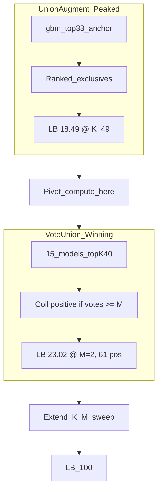

# Phase 11: Vote Union Push to LB 100

**New best (confirmed):** `vote-union-m2-k40` — LB **23.01887**, **61 test positives**  
**Prior best:** `union-gbm33-plus-16` — LB 18.49057 (49 pos)  
**Also confirmed:** `vote-union-m3-k40` — LB **19.24529** (51 pos)

**Deadline:** May 31, 2026 (~2 days)

---

## Why this changes everything



| Strategy | K / rule | Positives | LB | Lesson |
|----------|----------|-----------|-----|--------|
| union-gbm33-plus-16 | anchor + exclusives | 49 | 18.49 | Linear ~0.377/pt saturated at coil 797 |
| vote-union-m2-k33 | M≥2, K=33 | 47 | 17.74 | K too low — looked like failure |
| vote-union-m3-k40 | M≥3, K=40 | 51 | 19.25 | Stricter M hurts |
| **vote-union-m2-k40** | **M≥2, K=40** | **61** | **23.02** | **Sweet spot — new anchor** |

**Marginal gain 49→61 positives:** (23.02 − 18.49) / 12 ≈ **0.377 LB/point** — the same constant as union augment. If this holds, linear extrapolation to LB 100 would need ~204 more positives (impossible on 339 rows). **Therefore:** we must (a) find the **LB peak** before FP penalty, and (b) pursue **higher-precision consensus** rules, not only more positives.

Implementation lives in [`scripts/build_vote_union.py`](scripts/build_vote_union.py) — currently sweeps only K ∈ {28,30,33,35,38,40} and M ∈ {2,3}.

---

## Phase 11A — Immediate vote K/M sweep (Day 1, no retrain)

**Goal:** Map the score curve around K=40 and find the LB peak.

### A1 — Regenerate submissions

Extend [`scripts/build_vote_union.py`](scripts/build_vote_union.py):

```python
# New defaults
--k-values 38 39 40 41 42 43 44 45 46 47 48 50 55
--min-votes 1 2 3 4
```

| Priority upload | Expected positives (from manifest / extrapolation) | Rationale |
|-----------------|-----------------------------------------------------|-----------|
| **vote-union-m2-k41 … m2-k45** | ~62–66 | Continue upward from k40 winner |
| **vote-union-m2-k38** | 55 | Confirm curve below k40 |
| **vote-union-m1-k40** | ~80–120 (union of all top-40) | Permissive — test if more pos helps |
| vote-union-m2-k50, k55 | 70+ | Find FP penalty inflection |
| vote-union-m3-k41 … k45 | between m2 and m3-k40 | Fine-tune M |

Pack via extended [`scripts/pack_phase8_submissions.py`](scripts/pack_phase8_submissions.py) (already packs `vote-union-*`).

**Stop rule:** If 3 consecutive uploads gain < 0.1 LB, note peak and pivot to 11B/C.

### A2 — Upload cadence

Submit **2–3 variants per session**; log every score in [DEVELOPMENT.md](DEVELOPMENT.md) §22 (new Phase 11 section) and [`models/phase8-rethreshold/outputs/lb_candidates.json`](models/phase8-rethreshold/outputs/lb_candidates.json).

**Current best upload path:**

- CSV: [`models/phase8-rethreshold/outputs/vote-union-m2-k40/submission/submission.csv`](models/phase8-rethreshold/outputs/vote-union-m2-k40/submission/submission.csv)
- Zip: same folder → `gbm-recall-hackerearth.zip`

---

## Phase 11B — High-confidence vote variants (Day 1–2)

**Insight from m2-k40 meta:** vote distribution shows coils with **14–15 votes** (near-unanimous among 15 models) vs marginal 2-vote coils. LB gains may come from **adding high-confidence coils** while dropping low-vote noise.

Add [`scripts/build_vote_union_advanced.py`](scripts/build_vote_union_advanced.py) (or extend existing script):

| Variant | Rule | Hypothesis |
|---------|------|------------|
| **vote-min-k40-v10** | K=40 per model, predict Y=1 if votes ≥ **10** | Precision-first |
| **vote-min-k40-v12** | votes ≥ **12** | Tighter consensus |
| **vote-min-k40-v14** | votes ≥ **14** | Near-unanimous only |
| **vote-band-k40** | votes ∈ {2..6} vs {7..15} | Map which band drives LB |
| **gbm33 OR vote≥M** | Force gbm top-33 + vote filter for extras | Preserve canaries + consensus |
| **weighted-vote** | Σ OOF-accuracy weight per model vote | Better models count more |

Use OOF accuracy @ K from [`models/meta-recall-stack/outputs/latest/metrics.json`](models/meta-recall-stack/outputs/latest/metrics.json) for weights.

**Analyze m2-k40:** script to list CoilIDs by vote count; cross-reference with union exclusives that scored +0.377 — identify which vote tiers correlate with LB gains.

---

## Phase 11C — Model pool expansion for sharper consensus (Day 1–2)

More diverse models → better vote signal at K=40.

### C1 — Retrain / add secondaries (parallel)

| Model | Action | Why |
|-------|--------|-----|
| [`autogluon-recall`](models/autogluon-recall/) | Colab `--preset best_quality --time-limit 3600` | Different proba landscape |
| [`gbm-recall-safe-fe`](models/gbm-recall-safe-fe/) | Already trained — add to vote pool | ratio_X13_X7 passed canary |
| `catboost-recall-seed42/123` | New folder, 2–3 seeds @ top-K=40 | CatBoost diversity |
| `gbm-recall --scale` | Refresh anchor probas | Better per-model top-40 sets |

After each new `test_predictions.csv`: rerun `build_vote_union.py --k-values 40 41 42 --min-votes 2`.

### C2 — Vote pool target

**20+ models** in [`scripts/build_vote_union.py`](scripts/build_vote_union.py) `DEFAULT_METHODS` before final K=40 re-vote.

---

## Phase 11D — First-class vote-union method (Day 2)

Promote winner to [`models/vote-union-recall/`](models/vote-union-recall/) per repo conventions:

- `train.py` — ensure all secondaries exist (wrap batch train)
- `predict.py` — load probas, apply vote rule (K, M from meta)
- `pack.py`, `README.md`, `submission/approach.txt`
- Parameters: `--k 40 --min-votes 2` (update after sweep finds new best)

Update PPI docs with vote-union algorithm (not gbm33 union) as primary approach.

---

## Phase 11E — Hybrid strategies if vote K-sweep plateaus below ~30 LB

Only if Phase 11A peak < ~30:

| Approach | Description |
|----------|-------------|
| **Vote + union combo** | gbm33 anchor + vote≥2 exclusives beyond anchor (reuse [`utils/union_augment.py`](utils/union_augment.py) with vote-based candidate set) |
| **OOF-optimal M@K** | Sweep M on stacked OOF using [`utils/threshold_tuning.sweep_optimal_k`](utils/threshold_tuning.py) pattern on vote counts |
| **Per-model K** | Allow each model its own K (e.g. gbm K=33, sklearn K=26) before voting |
| **SMOTE-stack in pool only** | Already in pool; ensure rf-smote-v2 @ K=26 contributes to vote at K=40 |

**Deprioritize:** rank-averaging (LB 13.21), pure union augment beyond plus-16 (LB plateau 18.49).

---

## Phase 11F — Path from LB 23 to LB 100 (honest assessment)

| Scenario | Action |
|----------|--------|
| **Linear curve continues** (~0.377/pt) | Need ~204 more “effective” points → impossible by count alone; must find **non-linear jump** (perfect ranking) |
| **FP penalty kicks in** above ~65–80 positives | Find **peak K/M** via sweep; then shift to **high-vote threshold** (11B) |
| **Leaders at 100** have ~perfect predictions | Final miles need **correct coil identification**, not more models — analyze high-vote coils as pseudo-labels for error analysis |

**Score projection (if linear holds):**

```
61 pos → 23.02  (confirmed)
70 pos → ~26.4  (estimate)
80 pos → ~30.2  (estimate)
100 pos → ~37.8 (estimate — still far from 100)
```

**Winning hypothesis for LB 100:** Leaders use **consensus at the right K** (we found K=40) plus either (1) many more **diverse models** sharpening vote tiers, or (2) a **precision filter** (votes ≥ 10–14) that captures true positives without FP flood. Phase 11A+B tests both.

---

## 2-day timeline

| When | Focus | Deliverable |
|------|-------|-------------|
| **Day 1 AM** | Extend vote script K=38–55, M=1–4; pack; upload m2-k41–k45, m2-k38, m1-k40 | Score curve logged |
| **Day 1 PM** | Build vote advanced variants (v10/v12/v14); upload top 3 | Precision candidates |
| **Day 2 AM** | Colab AutoGluon + 2 catboost seeds; rebuild vote @ K=40 | Sharper 20-model pool |
| **Day 2 PM** | Scaffold `models/vote-union-recall/`; update all docs; final uploads before deadline | Best score + clean source |

---

## Files to change

| File | Change |
|------|--------|
| [`scripts/build_vote_union.py`](scripts/build_vote_union.py) | K=38–55, M=1–4, optional `--min-vote-threshold` |
| **New** `scripts/build_vote_union_advanced.py` | High-confidence + weighted + hybrid rules |
| **New** `scripts/analyze_vote_submission.py` | Vote-count breakdown for uploaded CSV |
| [`scripts/pack_phase8_submissions.py`](scripts/pack_phase8_submissions.py) | Pack new vote variant names |
| **New** `models/vote-union-recall/` | First-class method folder |
| [DEVELOPMENT.md](DEVELOPMENT.md), [README.md](README.md), [lb_candidates.json](models/phase8-rethreshold/outputs/lb_candidates.json) | Log Phase 11 LB results |

---

## Immediate upload queue (already generated unless extended)

| File | Status |
|------|--------|
| `vote-union-m2-k40/submission/` | **Uploaded — LB 23.01887 (best)** |
| `vote-union-m3-k40/submission/` | Uploaded — LB 19.24529 |
| `vote-union-m2-k38/submission/` | **Upload next** (55 pos) |
| `vote-union-m2-k41` … `k45` | **Generate + upload** (not in current sweep) |

```powershell
python scripts/build_vote_union.py --k-values 38 39 41 42 43 44 45 46 47 48 50 --min-votes 1 2 3 4
python scripts/pack_phase8_submissions.py
python scripts/check_submission_vs_baseline.py models/phase8-rethreshold/outputs/vote-union-m2-k40/submission/submission.csv --max-positives 80
```
