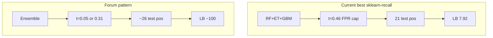
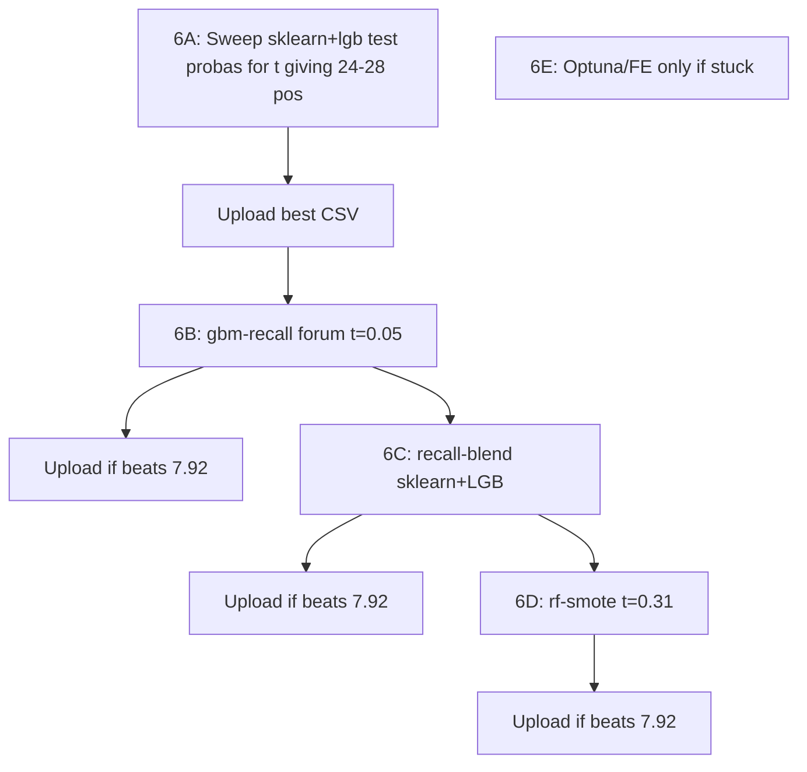

# Phase 6 — Push Toward Leaderboard ~100

## Where we are

| Method | HackerEarth | Test positives | Threshold | OOF recall @ chosen t |
|--------|-------------|----------------|-----------|---------------------|
| lightgbm-cv (old) | 1.88679 | 5 | 0.73 | 21% |
| lightgbm-recall | 7.16981 | 19 | 0.05 | 42% |
| **sklearn-recall** | **7.92453** | **21** | 0.46 (FPR cap) | 33% |
| gbm-recall | 5.66038 | 15 | 0.24 (FPR cap) | 33% |

**Progress:** Recall-first was correct — score scaled ~4× when test positives went from 5 → 21.

**Remaining gaps vs forum (~100 score):**
- Forum winners report **~26/339 positives (7.7%)**; we predict **15–21 (4.4–6.2%)** — still under-flagging.
- [`gbm-recall`](models/gbm-recall/train.py) never used the forum recipe (**equal GBM blend + t=0.05**); it used `target_fpr` → only 15 test positives and LB 5.66.
- **Phase 3 [`models/rf-smote/`](models/rf-smote/)** from the original plan was never built (forum: RF+SMOTE, t=0.31, 26 positives).
- No **cross-family blend** of our two best LB models (sklearn + LightGBM).

---

## Phase 6A — Threshold sweep to ~26 positives (no retrain, hours)

**Goal:** Find if sklearn-recall or lightgbm-recall can reach forum positive count without retraining.

**Actions:**

1. Extend [`utils/threshold_tuning.py`](utils/threshold_tuning.py) with:
   - `tune_target_positive_rate(y, proba, target_rate=0.077)` — pick threshold closest to 26/339 on OOF, report mapped test count
   - `tune_fixed_thresholds(y, proba, thresholds=(0.05, 0.31, 0.35))` — forum values

2. Extend [`scripts/run_phase0_threshold_sweep.py`](scripts/run_phase0_threshold_sweep.py) to sweep **saved** test probas from:
   - [`models/sklearn-recall/outputs/latest/predictions/test_predictions.csv`](models/sklearn-recall/outputs/latest/predictions/test_predictions.csv)
   - [`models/lightgbm-recall/outputs/latest/predictions/test_predictions.csv`](models/lightgbm-recall/outputs/latest/predictions/test_predictions.csv)

3. Submit top 1–2 CSVs where:
   - Test positives in **24–28**
   - All canary coils `{654, 806, 532, 958, 1187}` remain `Y=1` ([`scripts/check_submission_vs_baseline.py`](scripts/check_submission_vs_baseline.py))

**Expected:** sklearn at **t≈0.31** may land near 26 positives (forum SMOTE post used this threshold).

---

## Phase 6B — Fix gbm-recall: forum ensemble + t=0.05

**Problem:** [`gbm-recall`](models/gbm-recall/train.py) selected `target_fpr` (t≈0.24, 15 test pos, LB 5.66) instead of forum **t=0.05** on equal LGB+XGB+CatBoost blend.

**Actions:**

1. Add `--threshold-strategy forum_fixed` to `gbm-recall/train.py` (or new `models/gbm-recall-forum/`) that:
   - Keeps equal 1/3 blend weights
   - Sets threshold to **0.05** (or runs Phase 6A sweep on blend test probas and picks best in 24–28 range)
   - Saves `threshold_strategy: "forum_fixed_0.05"` in meta

2. Train, predict, guard-check, pack, upload.

**Hypothesis:** Phase 0 showed gbm-ensemble-blend at t=0.05 → **33 test positives** with all canaries positive — may beat gbm-recall's 5.66 if precision/recall tradeoff is better than sklearn's.

---

## Phase 6C — `models/recall-blend/` (sklearn + LightGBM)

**Why:** sklearn-recall (7.92) and lightgbm-recall (7.17) have **different errors**; averaging probabilities is low cost and forum winners use ensembles.

**Pipeline:**

- Features: [`utils/tabular_features.py`](utils/tabular_features.py) (same as lightgbm-recall)
- Stratified 5-fold CV:
  - Fold A: train [`sklearn-recall`](models/sklearn-recall/train.py) trio (RF+ET+GBM, median impute, class_weight 1:30)
  - Fold B: train LightGBM (same params as lightgbm-recall)
  - OOF blend: `0.5 * proba_sklearn + 0.5 * proba_lgbm`
- Threshold: Phase 6A sweep targeting **~26 test positives** (not FPR cap alone)
- Final fit both on full train; blend test probas

**Pre-upload:** canary check + positive count 24–28.

---

## Phase 6D — `models/rf-smote/` (original Phase 3)

**Forum pattern:** RF + SMOTE, threshold **0.31**, 26/339 positives, claimed 100% recall.

**Pipeline:**

- [`imblearn`](https://imbalanced-learn.org/) in `requirements.txt`
- Median impute inside CV only
- `SMOTE` applied **only on training fold** via `imblearn.pipeline.Pipeline` + `StratifiedKFold` (strict leakage guard)
- `RandomForestClassifier(class_weight={0:1, 1:30})` or SMOTE-only without double weighting
- Threshold: start **0.31** fixed; also sweep 0.25–0.35 in Phase 6A script
- Standard method folder layout: `train.py`, `predict.py`, `pack.py`, `submission/approach.txt`

---

## Phase 6E — Model quality (only if 6A–6D plateau below ~20 LB)

Do **not** repeat heavy FE ([`lightgbm-fe`](models/lightgbm-fe/) destroyed canary proba). Instead:

1. **Optuna** on LightGBM hyperparams (same features as lightgbm-recall) optimizing OOF PR-AUC, then Phase 6A threshold on new probas
2. **One feature at a time** with canary guard (only keep if coils 806/1187 proba do not drop)
3. **10-fold CV** for stabler OOF threshold selection

---

## Infrastructure updates

| Item | File |
|------|------|
| Log new LB scores | [`DEVELOPMENT.md`](DEVELOPMENT.md) §16 — add 7.17, 7.92, 5.66 rows |
| Target-positive threshold helper | [`utils/threshold_tuning.py`](utils/threshold_tuning.py) |
| Re-sweep script | [`scripts/run_phase0_threshold_sweep.py`](scripts/run_phase0_threshold_sweep.py) |
| Optional: generate submission from saved probas only | `scripts/rethreshold_submission.py` (no retrain) |

---

## Recommended execution order

| Step | Effort | Expected test pos | When to skip |
|------|--------|-------------------|--------------|
| 6A | 1–2 hrs | 24–28 | Never — do first |
| 6B | 2–3 hrs | ~33 @ t=0.05 | If 6A beats 7.92 |
| 6C | 4–6 hrs | 24–28 | If 6A/6B beat 7.92 |
| 6D | 1 day | ~26 | If still below ~20 LB |
| 6E | 1–2 days | — | Last resort |

---

## What to avoid

- **High thresholds (0.7+)** — proved to cap LB at ~1.89
- **Blending without low-threshold retune** — caused gbm-ensemble regression
- **Heavy FE before threshold/count tuning** — lightgbm-fe wrecked canary coils
- **100% OOF recall at t→0** without `max_positive_rate` cap — sklearn nearly predicted 334/339 once

---

## Success criteria

- **Next milestone:** HackerEarth score **> 7.92** (beat sklearn-recall)
- **Intermediate:** test positives **24–28** with all canaries `Y=1`
- **Stretch:** approach forum **~100** (likely needs SMOTE + ensemble + correct threshold band)

**Fallback:** Keep [`models/sklearn-recall/submission/`](models/sklearn-recall/submission/) (7.92453) as baseline until a new method beats it on HackerEarth.
