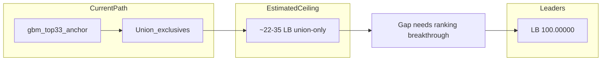

# Plan: Win Tata Steel AI Hackathon (Target LB 100)

**Platform:** [HackerEarth](https://www.hackerearth.com/challenges/competitive/tata-steel-ai-hackathon/machine-learning/fd-a5a6dcb2/) (not HackerRank)  
**Deadline:** May 31, 2026  
**Current best:** **15.84906** — [`union-gbm33-plus-9`](models/phase8-rethreshold/outputs/union-gbm33-plus-9/submission/submission.csv) (42 test positives)  
**Your priorities:** Maximize LB score **and** maintain strong, reproducible source for PPI review  
**Compute:** Local Intel Iris Xe + CPU **and** Google Colab in parallel

---

## Reality check (read this first)



| Fact | Implication |
|------|-------------|
| Union gains are **linear ~+0.377 LB per exclusive** in K=38–42 band ([DEVELOPMENT.md §20F](DEVELOPMENT.md)) | Proven strategy — keep doing it |
| ~**59 disagreement coils** exist beyond gbm33; only **9** used in plus-9 | ~50 exclusives remain in pool — headroom exists |
| Linear extrapolation: 15.85 + 50×0.377 ≈ **34.7 LB max** from union alone | **Union cannot reach 100 by itself** |
| Public LB shows many tied at **100.00000**; mid-board ~73–74 | Perfect solutions exist — need **correct coil ranking**, not just more positives |
| Probability averaging **failed** (canary coils 806/1187); union **works** | Never revert to prob-blend; use coil-ID union / rank-based rules |

**Winning hypothesis:** Leaders combine (1) recall-first top-K (~26–45 positives) with (2) models that **rank the right coils** into that set. Our union fixes missed TPs incrementally; reaching 100 requires replacing weak exclusives with better base rankers and multi-model agreement.

---

## What online winners do (tabular, imbalanced — applicable here)

Research on similar tabular / fraud / churn competitions consistently points to:

1. **Gradient boosting trio:** LightGBM + XGBoost + CatBoost with `scale_pos_weight` / class weights ([stacking papers](https://www.researchgate.net/publication/397047638), [fraud detection pipelines](https://medium.com/@sundanc/building-a-cutting-edge-fraud-detection-system-with-ensemble-learning-and-hyperparameter-4c36ae89ed82))
2. **SMOTE inside CV** (not on full train) + RF/ET — forum-aligned for this exact problem type ([DEVELOPMENT.md §14](DEVELOPMENT.md))
3. **Stacking with top-K output** — meta-learner on OOF probas, then **rank/threshold** for submission (not raw t=0.31)
4. **Rank averaging** across models — stabilizes scores vs raw probability mean (Kaggle diabetes pipeline pattern)
5. **NOT useful here:** Image/CNN steel defect papers, TabPFN/pretrained foundation models (**violates no-external-data rule**)

Your repo already implements most of (1)–(3). The gap is **execution speed**, **model diversity**, and **ranking quality**.

---

## Intel Iris Xe GPU — what to use it for

| Library | Iris Xe support | Action |
|---------|-----------------|--------|
| **scikit-learn-intelex** | Yes — `target_offload="gpu:0"` on Windows | Accelerate RF/ET/KNN in [`sklearn-recall`](models/sklearn-recall/train.py), [`rf-smote-v2`](models/rf-smote-v2/train.py) |
| **LightGBM / XGBoost / CatBoost** | CUDA only — **no Iris Xe** | `n_jobs=-1` on CPU; dataset is only 1,352 rows so GPU would barely help anyway |
| **AutoGluon** | Best on Colab CPU/GPU | Run `best_quality` on **Colab**; keep local `medium_quality` as fallback |

**Setup (local):** Add `scikit-learn-intelex` to [`requirements.txt`](requirements.txt); wrap sklearn training with:

```python
from sklearnex import patch_sklearn, config_context
patch_sklearn()
with config_context(target_offload="gpu:0"):
    model.fit(X, y)
```

Add a `--cpu-only` fallback flag if GPU init fails.

---

## Phase 10A — Immediate LB mapping (Day 1, ~2 hours, no retrain)

**Goal:** Map the score curve and harvest remaining union headroom before any slow training.

1. **Regenerate union K=43–55** (and untested plus-3, plus-4):

```powershell
python scripts/build_union_submission.py --target-ks 36 37 43 44 45 46 47 48 49 50
python scripts/pack_phase8_submissions.py
python scripts/check_submission_vs_baseline.py models/phase8-rethreshold/outputs/union-gbm33-plus-9/submission/submission.csv --max-positives 55
```

2. **Ensure full secondary pool loaded** — [`utils/union_augment.py`](utils/union_augment.py) already lists `catboost-recall`, `meta-recall-stack`, `autogluon-recall`; retrain/predict any missing before rebuild.

3. **Upload cadence:** Submit **every 2–3 K values** (HackerEarth daily limit aware); log scores in [DEVELOPMENT.md §20F](DEVELOPMENT.md) and [`models/phase8-rethreshold/README.md`](models/phase8-rethreshold/README.md).

4. **Run disagreement refresh:**

```powershell
python scripts/analyze_model_disagreement.py --k-values 33 42 50 55 --methods gbm-recall lightgbm-recall sklearn-recall catboost-recall autogluon-recall meta-recall-stack rf-smote-v2
```

**Stop rule:** If marginal gain drops below 0.1 LB for 3 consecutive K uploads, union path is saturated — pivot compute to Phase 10C.

---

## Phase 10B — Fast parallel model factory (Days 1–2)

**Goal:** 15–20 diverse models in 24h using fixed hyperparams (no 30-trial Optuna loops).

### Local batch (parallel terminals / joblib)

| New/updated method | Algorithm | Why | Time |
|-------------------|-----------|-----|------|
| [`catboost-recall`](models/catboost-recall/) | CatBoost depth 6–8, multiple seeds | Often best on tabular; underused in union | ~5 min |
| `models/xgb-recall/` (new) | XGB solo @ top-K=33 | Diversity vs LGB anchor | ~5 min |
| `models/lgb-seedblend-recall/` (new) | 5× LGB seeds, **rank-avg** then top-K | Rank avg ≠ prob avg | ~15 min |
| [`rf-smote-v2`](models/rf-smote-v2/) + intellex | BorderlineSMOTE + RF @ K=26 | Forum SMOTE path, fixed top-K | ~10 min |
| `models/knn-positive-profile/` (new) | kNN distance to train Y=1 manifold | Catches positives GBMs miss | ~5 min |
| [`gbm-recall`](models/gbm-recall/train.py) `--scale` | 2000 trees, 10-fold | Refresh anchor ranking | ~20 min |

**Convention:** Each method → `train.py` → `predict.py` → save `outputs/latest/predictions/test_predictions.csv` → add to union secondary pool.

### Colab batch (heavy)

| Run | Config | Purpose |
|-----|--------|---------|
| [`autogluon-recall`](models/autogluon-recall/) | `presets='best_quality'`, `time_limit=3600`, `num_cpus=4` | Auto feature interactions + multi-model |
| Optional Optuna | 8 trials max, OOF @ top-K objective only | Only if fast variant beats gbm anchor offline |

**Anti-pattern:** Do not run 30-trial 3-model CV Optuna locally — this is what slowed Phase 9.

---

## Phase 10C — Ranking breakthrough (Days 2–3) — critical for LB 100

These are the highest-upside strategies **not yet fully exploited**:

### C1 — Vote union (new script)

Extend [`scripts/build_union_submission.py`](scripts/build_union_submission.py) or add `scripts/build_vote_union.py`:

- Coil is **positive** if it appears in top-K of **≥ M of N** models (e.g. M=2, N=10, K=30)
- Always force canaries `{654, 806, 532, 958, 1187}`
- Sweep M ∈ {2,3} and K ∈ {28, 30, 33, 35, 38, 40}

**Why:** Reduces false exclusives from a single weak model; leaders likely use consensus.

### C2 — Rank averaging before top-K

New utility in [`utils/threshold_tuning.py`](utils/threshold_tuning.py):

```python
rank_mean = np.mean([scipy.stats.rankdata(p) for p in probas], axis=0)
pred = apply_top_k(rank_mean, k=33, force_positive_idx=canaries)
```

Test on 5–8 models. **Different from failed prob averaging** — preserves relative ordering per model.

### C3 — SMOTE stacking pipeline (new `models/smote-stack-recall/`)

Based on forum + literature ([rf-smote](models/rf-smote/train.py) failed at t=0.31; [rf-smote-v2](models/rf-smote-v2/) fixed with top-K):

```
BorderlineSMOTE (inside CV) → base: CatBoost + LGB + RF(intellex)
→ meta: LogisticRegression on OOF
→ output: top-K=33..40 with canary guard
```

### C4 — Positive-profile kNN (`models/knn-positive-profile/`)

1. Impute + scale on train Y=1 only (66 samples)
2. For each test row: `score = max cosine_similarity to any train positive)` or kNN vote
3. Union kNN top-15 exclusives into gbm33 anchor (reuse [`utils/union_augment.py`](utils/union_augment.py))

**Why:** With only 66 positives, explicit similarity to positive manifold may rank test defects better than tree splits alone.

### C5 — OOF-optimal K selector

Script: sweep K=20..55 on **stacked OOF probas** maximizing OOF accuracy @ K; apply chosen K to test. Upload 3–5 K candidates around the OOF peak.

---

## Phase 10D — Anchor and meta upgrade (Day 2)

1. **Replace gbm33 anchor if improved:** Compare scaled gbm-recall, catboost-recall, rank-avg blend @ K=33 on canary guard + OOF accuracy @ 33
2. **Upgrade [`meta-recall-stack`](models/meta-recall-stack/train.py):** Ensure objective is OOF accuracy @ K (not train loss); add rank-avg and vote-union as input channels
3. **Retire proven failures:** No [`gbm-recall-fullmiss`](models/gbm-recall-fullmiss/) (canary fail), no prob averaging ([`gbm-ensemble`](models/gbm-ensemble/))

---

## Phase 10E — Guarded feature engineering (Day 3, low risk)

Automate safe FE only:

1. Generate ratio candidates from top-10 SHAP feature pairs (from gbm-recall importance)
2. Batch probe via [`scripts/probe_single_feature.py`](scripts/probe_single_feature.py) — **reject** if proba drops on coils 806/1187
3. Add passing features to a new `models/gbm-recall-safe-fe/` (not full_miss — that failed guard)

**Steel-domain ratios to prioritize:** X13/X10, X30/X32, X15 missing indicators (single-column, not all-49 miss grid).

---

## Phase 10F — Upload strategy and PPI-quality deliverables (ongoing)

### Submission priority queue

| Priority | Candidate | Expected gain |
|----------|-----------|---------------|
| P0 | union-gbm33-plus-10..15 | Low–medium (proven path) |
| P1 | Vote union M=2, K=33/35 | Medium–high |
| P2 | Rank-avg @ K=33/35 | Medium–high |
| P3 | smote-stack @ K=33–40 | High if forum recipe works |
| P4 | kNN-profile union | High (novel) |
| P5 | Colab AutoGluon best_quality union secondary | Medium |

### Code quality for PPI (parallel track)

For every upload method, ensure:

- [`approach.txt`](models/union-gbm33-augment/submission/approach.txt) updated with algorithm, CV, threshold, reproduction steps
- `pack_submission.py` zip passes validation
- [`README.md`](models/union-gbm33-augment/README.md) Results section reflects latest LB
- Clean `train.py` / `predict.py` with seeds, `--data-dir`, artifact layout per [workspace rules](.cursor/rules/tata-steel-ml-methods.mdc)

---

## 4-day timeline

| Day | Focus | Deliverables |
|-----|-------|--------------|
| **May 27 (today)** | Phase 10A uploads K=43–50; start model factory batch 1 | Score curve in DEVELOPMENT.md |
| **May 28** | Finish factory; Colab AutoGluon; vote union + rank-avg scripts | 5+ new test prediction files |
| **May 29** | smote-stack + kNN-profile; meta-stack v2; anchor comparison | 3 high-upside submission candidates |
| **May 30** | Best combo uploads; safe FE if any pass guard | Top-3 LB candidates identified |
| **May 31** | Final uploads before deadline; polish approach.txt + README | Best score + clean source zip |

---

## Success metrics

| Milestone | Target | If missed |
|-----------|--------|-----------|
| Union saturation mapped | K curve logged through K=50+ | Still valuable data |
| LB short-term | **>20** (beat linear union expectation) | Pivot harder to C2/C3 |
| LB stretch | **>50** | Score metric may reward precision jump at threshold |
| LB win | **100** | Requires near-perfect ranking — vote union + smote stack most likely paths |
| PPI readiness | Reproducible method folder + approach.txt for best submission | Required regardless of LB |

---

## Key files to extend

- [`utils/union_augment.py`](utils/union_augment.py) — vote union, kNN secondary source
- [`scripts/build_union_submission.py`](scripts/build_union_submission.py) — K sweep, new ranking modes
- [`utils/threshold_tuning.py`](utils/threshold_tuning.py) — rank averaging, OOF-optimal K
- [`models/sklearn-recall/train.py`](models/sklearn-recall/train.py) — sklearn-intelex GPU path
- New: `scripts/build_vote_union.py`, `models/smote-stack-recall/`, `models/knn-positive-profile/`

---

## What we will NOT do

- External datasets or pretrained TabPFN / transfer models
- Probability averaging (proven harmful)
- Full missing-indicator grid without canary guard
- Long Optuna runs on local machine
- CUDA-only tooling expecting Iris Xe to accelerate XGB/LGB
